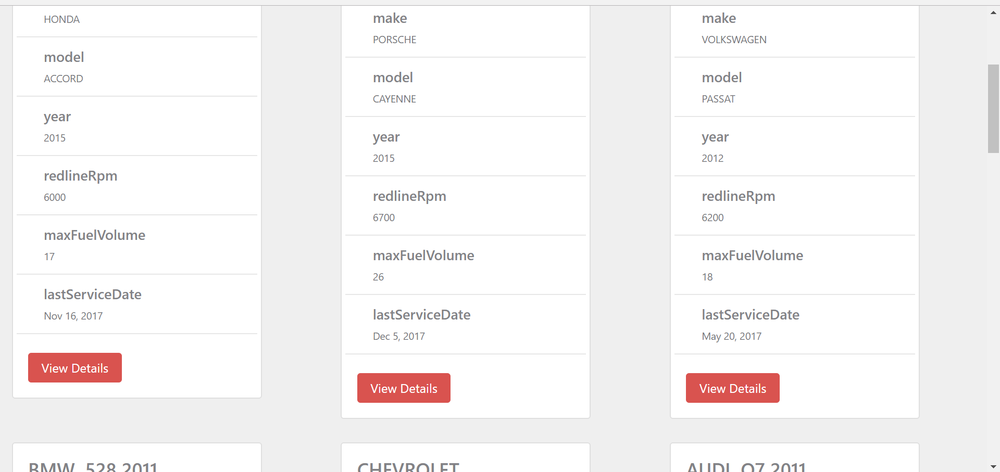
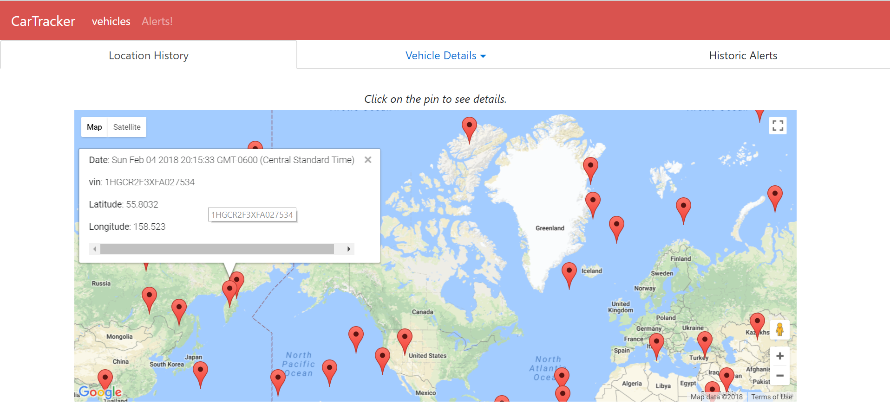
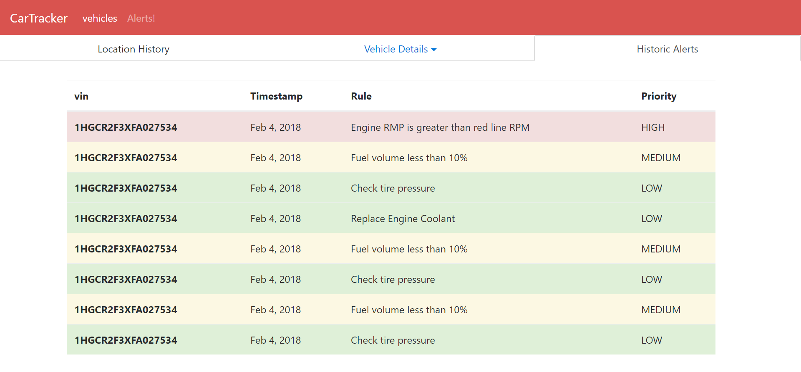

# car-tracker-seed
seed for the Full-Stack IOT training project: car-tracker

## application walkthrough:
home page contains details of all vehicle as shown in the screenshots below. Full details can be seen by clicking on the *view details* button.

when clicked on the view details button, it takes user to vehicle details page which contains a map showing location history of last 20 minutes as shown below.

A different tab shows history of all alerts for the vehicle color coded by warning type

## directory structure:

**`client`** [*module-client*]: contains ui app (HTML, CSS, JS, fonts, images)      
**`api`** [*module-api*]: contains REST API

## mock sensor: 
[http://mocker.egen.io](http://mocker.egen.io)

## requirements:
[https://learn.egen.io](https://learn.egen.io/courses/overview.html)
