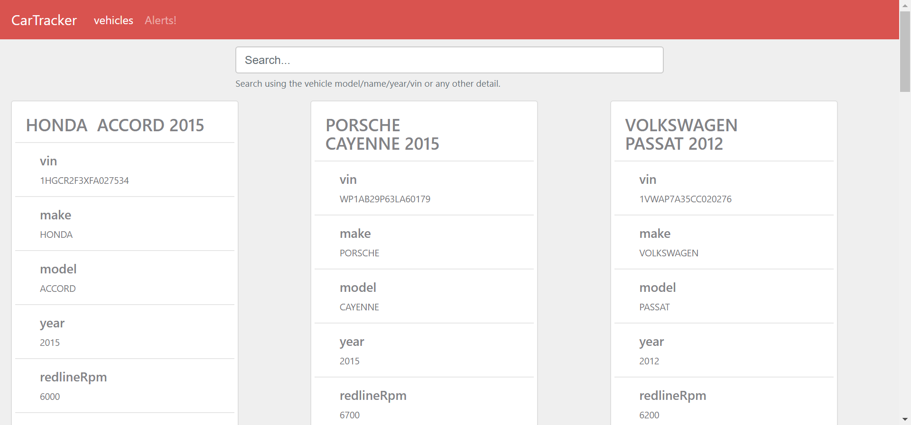
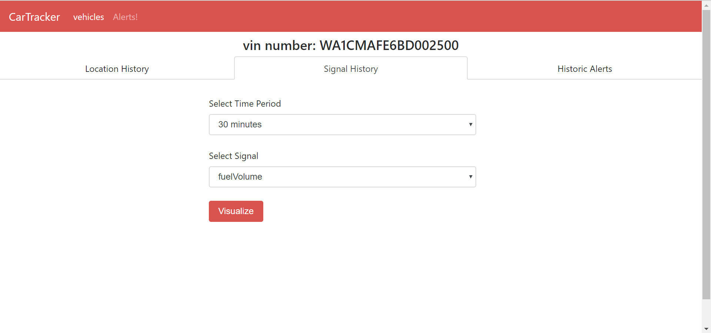

IoT Pet project. Objective was to get my hands dirty with Java Spring framework.

## application walkthrough:
home page contains details of all vehicle as shown in the screenshots below. Full details can be seen by clicking on the *view details* button.

when clicked on the view details button, it takes user to vehicle details page which contains a map showing location history of last 20 minutes as shown below.

A different tab shows history of all alerts for the vehicle color coded by warning type

When clicked on signal hostory two drop downs appear. One to select signal type and other to select the time period. 

Hit visualize to create a chart below as shown in the below two screenshots

## directory structure:

**`client`** [*module-client*]: contains ui app (HTML, CSS, JS, fonts, images)      
**`api`** [*module-api*]: contains REST API

## mock sensor: 
[http://mocker.egen.io](http://mocker.egen.io)
